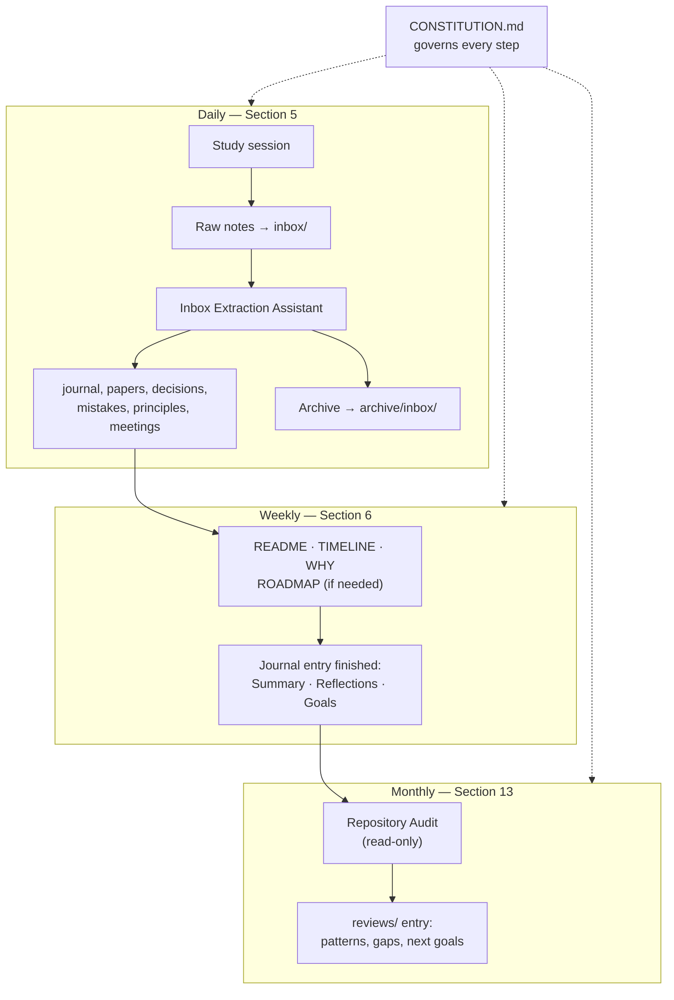
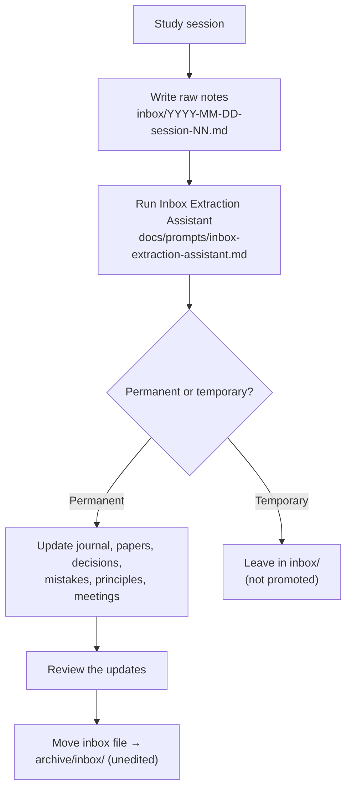
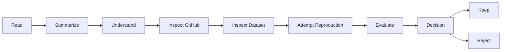
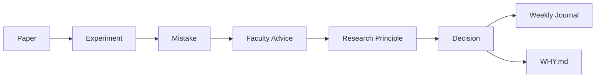

# GUIDE — Operating Manual

This is not documentation for contributors. This is the manual for how *I* use this repository, every day, every week, and across the full research lifecycle, for as long as this project runs. When in doubt about what to do next, read this file before improvising.

This file covers workflow and mechanics — *when* and *how* to do things. It does not cover *how an AI assistant should behave* while doing them; that's [CONSTITUTION.md](CONSTITUTION.md), and it outranks this file if the two ever conflict.

For the *mechanics* of the repository (ID scheme, folder layout, how links work), see [docs/naming-convention.md](docs/naming-convention.md) and [docs/cross-linking-strategy.md](docs/cross-linking-strategy.md). This guide does not repeat that — it tells you when and why to use it.

## System Overview

Everything in this guide is one of three cadences, all governed by [CONSTITUTION.md](CONSTITUTION.md):



---

## 1. Repository Purpose

This repository is a research knowledge base, not a notebook. A notebook records what happened. This records what happened, why it happened, what evidence supports it, and what changed as a result. It exists to document research progress, decisions, experiments, failures, lessons learned, faculty guidance, and reproducible research — continuously, across undergraduate research, a master's, and a PhD.

## 2. Research Philosophy

- Document decisions, not just results. A result without the decision that led to it is half a record.
- Failures are valuable research artifacts. A rejected paper or a failed reproduction gets exactly as thorough an entry as a success.
- Every important decision should have a stated reason — see [04-decisions/](04-decisions/README.md).
- Every mistake should produce a lesson — see [05-lessons/mistakes/](05-lessons/mistakes/README.md) and [05-lessons/principles/](05-lessons/principles/README.md).
- Research should be reproducible. If a future reproduction attempt can't follow an entry step by step, the entry isn't finished.
- Everything is connected through Markdown links — an entry with no `Related` links is an orphan, and orphans defeat the purpose of this repository.
- Taken together, the repository should tell the complete story of the research — not just its outcomes.

## 3. Before Starting a New Topic

- [ ] Open a [00-questions/](00-questions/README.md) entry for the research problem
- [ ] Read introductory / review material
- [ ] Log new terminology in [glossary/](glossary/README.md) as it comes up
- [ ] Explore relevant datasets — [datasets/](datasets/README.md)
- [ ] Search for methodology papers — [01-papers/](01-papers/README.md)
- [ ] Verify reproducibility before committing (see checklist below)
- [ ] Check dataset availability
- [ ] Check source code quality
- [ ] Only then select the paper to reproduce, and record the decision in [04-decisions/](04-decisions/README.md)

This order matters — see [PRIN-001](05-lessons/principles/PRIN-001-baseline-before-novelty.md): a baseline comes before novelty, and a topic comes before a paper, not the other way around.

## 4. Before Selecting a Paper

Check, for every candidate:

- [ ] Publication venue
- [ ] Publication year
- [ ] Source code available
- [ ] Dataset available
- [ ] Complete documentation
- [ ] Reproducible pipeline
- [ ] Dependencies documented
- [ ] Training pipeline available
- [ ] Preprocessing explained
- [ ] Evaluation metrics explained

If any critical item is missing, record the issue in the paper's `Critique / Limitations` section *before* deciding whether to reject it — see [PRIN-002](05-lessons/principles/PRIN-002-prefer-reproducible-papers.md) and the worked example in [PAPER-001](01-papers/PAPER-001-mirna-disease-baseline-candidate.md).

## 5. Daily Workflow

Do not write directly into permanent entries while studying. Capture first, curate second:



At the end of every study session (or during it), write raw notes into a new file in [inbox/](inbox/README.md) — don't wait until the end of the week to reconstruct it, and don't try to organize it while writing it. No formatting required: what I studied, what I understood, what confused me, new terminology, questions, problems, ideas, faculty advice recalled informally. See [inbox/README.md](inbox/README.md) for the exact naming pattern and [inbox/_template.md](inbox/_template.md) to start one.

Then run the [Inbox Extraction Assistant](docs/prompts/inbox-extraction-assistant.md) prompt over that file. It reads the raw notes and updates the current week's journal entry, plus any other affected documents (papers, decisions, mistakes, principles, meetings), following the templates and cross-linking rules already in place. It never invents information, and it reports back which notes were promoted to permanent knowledge and which stayed temporary.

Close every session by making sure the current week's journal entry answers three questions, right in that day's **Daily Notes** entry — the extraction assistant does this as part of its update, but check it:

1. What did I learn today?
2. What is still unclear?
3. What is the next smallest actionable step?

This is what makes it possible to resume work after a break without re-reading everything. Once the update is reviewed, move the inbox file to [archive/inbox/](archive/inbox/README.md) — unedited, per Section 14.

The inbox is exempt from the cross-linking rules in Section 11: it is temporary thinking, not a permanent entry, and does not get a `Related` section. Once a paper has actually been read and is ready to be written up properly (not just captured), follow the Paper Workflow in Section 8 directly, using [01-papers/_template.md](01-papers/_template.md).

Every AI assistant action in this repository — including the Inbox Extraction Assistant — is bound by [CONSTITUTION.md](CONSTITUTION.md) first, this Guide second.

## 6. Weekly Workflow

Every week, update:

- [README.md](README.md) — Current Status snapshot
- [TIMELINE.md](TIMELINE.md) — one row per item created or closed this week
- [WHY.md](WHY.md) — one row per decision made this week
- [ROADMAP.md](ROADMAP.md) — only if a milestone was hit or priorities shifted
- [journal/](journal/README.md) — the week's entry, finished (Summary, Reflections, Goals for Next Week)
- [05-lessons/mistakes/](05-lessons/mistakes/README.md) — any mistakes made
- [meetings/](meetings/README.md) — any faculty advice received
- [05-lessons/principles/](05-lessons/principles/README.md) — any principle distilled
- [04-decisions/](04-decisions/README.md) — any decisions made
- [01-papers/](01-papers/README.md) — any paper notes updated

## 7. Meeting Workflow

After every faculty meeting, fill in [meetings/_template.md](meetings/_template.md) the same day, recording: date, questions asked, advice given, corrections, action items with deadlines, related papers, and related mistakes. Don't rely on memory past the day it happened — advice paraphrased loosely a week later is not the same advice.

## 8. Paper Workflow

For every paper, follow the pipeline the [01-papers/_template.md](01-papers/_template.md) is built around:



The `Decision` step is not optional and is not implicit — it gets its own entry in [04-decisions/](04-decisions/README.md), linked back from the paper, regardless of whether the outcome is "keep" or "reject."

## 9. Experiment Workflow

Every experiment ([03-experiments/_template.md](03-experiments/_template.md)) documents: objective, dataset, model, parameters, results, problems encountered, lessons, and the next experiment. If a problem generalizes, it becomes a [05-lessons/mistakes/](05-lessons/mistakes/README.md) entry linked from the experiment, not just a note buried in the results.

## 10. Mistake Workflow

Every mistake ([05-lessons/mistakes/_template.md](05-lessons/mistakes/_template.md)) documents: description, cause, impact, solution, lesson, and links to the related paper, faculty advice, and journal entry. A mistake with no cause recorded is just a complaint; the cause is the part that prevents repeating it.

## 11. Cross-Linking Rules

Every entry links to related entries, following the lifecycle:



Full mechanics, worked examples, and relative-path rules are in [docs/cross-linking-strategy.md](docs/cross-linking-strategy.md) — read that once, then apply it by habit.

## 12. Naming Rules

Use the ID scheme consistently: `Question-`, `Paper-`, `Reproduction-`, `Experiment-`, `Decision-`, `Mistake-`, `Principle-`, `Meeting-`, `Dataset-`, `Term-`, `Idea-`, `Review-`, `Week-`. Full prefixes and file-naming rules are in [docs/naming-convention.md](docs/naming-convention.md). Never invent a new prefix on the fly — if a new type of entry seems needed, decide on its prefix once and add it to that file.

[inbox/](inbox/README.md) files are the one deliberate exception: they're dated (`YYYY-MM-DD-session-NN.md`), not ID-prefixed, because they're temporary raw notes, not permanent entries — see Section 5.

## 13. Monthly Review

At the end of every month, fill in a [reviews/](reviews/README.md) entry: biggest lessons, common mistakes (patterns, not just a list), research progress, knowledge gaps, and next month's goals. This is where recurring mistakes actually get noticed — a mistake that shows up in three different weekly journals is a pattern, and the monthly review is the only place that comparison happens deliberately.

Before writing the review, run the [Repository Audit](docs/prompts/repository-audit.md) prompt. It's read-only — it reports redundant, outdated, or oversized files, broken links, unused templates, and drift from this guide and [CONSTITUTION.md](CONSTITUTION.md), without changing anything itself. Its findings feed directly into the review entry; what you actually act on is a separate, deliberate decision afterward.

## 14. Things Never To Do

- Never overwrite history. Never delete a mistake. Never delete a rejected paper. Never rewrite a previous decision.
- Instead, append new knowledge: if a decision changes, create a new `DEC-` entry and mark the old one `Superseded By` the new one.
- Never reuse an ID, even for something abandoned.
- Research is an evolving process — the record of being wrong is as valuable as the record of being right.

## 15. Repository Maintenance

- Keep files short and focused on one entry.
- Use Markdown headings consistently — don't improvise new section names inside a template.
- Link related notes; an entry without a `Related` section is incomplete.
- Avoid duplicated information — link to the canonical entry instead of re-explaining it (e.g. link to a [glossary/](glossary/README.md) term instead of redefining it inline).
- Prefer updating an existing page over creating an unnecessary new one — but never by erasing what was there before (see Section 14).

## 16. End Goal

The repository should become a complete record of the research journey. Treat it as if a new researcher is joining the project six months from now, and every note should let them answer: what happened, why did it happen, what evidence supports it, what decision was made, and what should happen next. If that person could reconstruct the reasoning using only this repository, it has done its job.

---

## 17. Additional Conventions

**Facts vs. opinions.** When writing analysis (paper critiques, experiment results, reproduction notes), label claims by kind so assumptions don't quietly become facts:

```
Fact: The paper reports an AUROC of 0.96 on HMDD v3.2.
Observation: The repository lacks preprocessing scripts.
Inference: Reproducing the reported results may require reverse-engineering preprocessing.
Question: Did the authors use any undocumented preprocessing?
```

This is optional formatting, not a required field — use it wherever a claim's certainty actually matters (paper critiques and reproduction evaluations, most often).

**Idea Parking Lot.** Not every idea is worth pursuing immediately. Log it in [ideas/](ideas/README.md) instead of letting it interrupt current work, and revisit it during a monthly review or when a stronger baseline exists.
