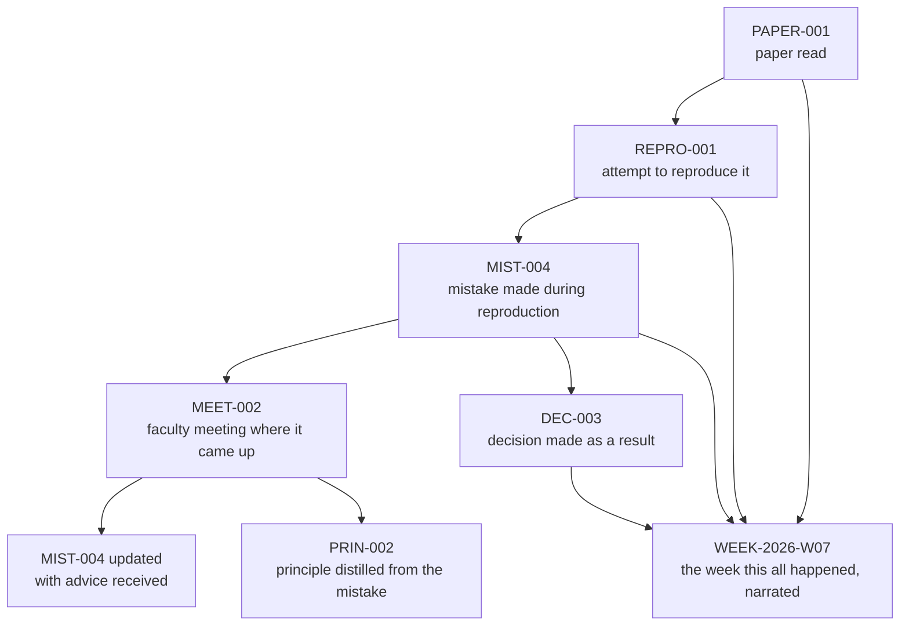

# Cross-Linking Strategy

The value of this repository comes from its links, not its content in isolation. A paper without a link to the mistake it caused, or a mistake without a link to the advice that corrected it, is just a note. This document defines how linking works so it stays consistent for years.

## Every Entry Ends With a "Related" Section

Every template ends with a `## Related` section listing links to other entries, grouped by type. Leave a category out if it doesn't apply — do not leave placeholder rows.

The shape (hypothetical example — not a real entry in this repository, so the paths intentionally don't resolve):

```markdown
## Related

- Paper: [PAPER-XXX — <Some Method's Architecture>](../01-papers/PAPER-XXX-some-method-architecture.md)
- Mistake: [MIST-XXX — <What Went Wrong>](../05-lessons/mistakes/MIST-XXX-what-went-wrong.md)
- Decision: [DEC-XXX — <What Changed As A Result>](../04-decisions/DEC-XXX-what-changed.md)
```

For a real, working example from this repository, see the `## Related` section of [DEC-004](../04-decisions/DEC-004-reject-paper-001.md).

## Links Are Always Relative

Use relative Markdown links (`../folder/FILE.md`), never absolute GitHub URLs, so links work identically on GitHub, locally, and in any future fork or mirror.

Relative path depth from each folder to the others:

| From | To `01-papers/` | To `05-lessons/mistakes/` |
|---|---|---|
| `01-papers/` | `PAPER-001-....md` | `../05-lessons/mistakes/MIST-001-....md` |
| `02-reproductions/` | `../01-papers/PAPER-001-....md` | `../05-lessons/mistakes/MIST-001-....md` |
| `journal/2026/` | `../../01-papers/PAPER-001-....md` | `../../05-lessons/mistakes/MIST-001-....md` |

## Links Are Bidirectional — By Convention, Not Automation

If entry A links to entry B, go add a reciprocal link from B back to A, on the same day. This repository has no link-checking automation by design (see Navigation Guide for why) — the discipline is manual, and it is the single habit that keeps the knowledge base connected instead of becoming a pile of disconnected notes.

## Worked Example: A Full Research Thread

This is the pattern the whole system is built around:



Concretely, this means:

- `REPRO-001` links back to `PAPER-001` in its metadata, and `PAPER-001` links forward to `REPRO-001` under Related.
- `MIST-004` links to `REPRO-001` (where it happened), `MEET-002` (where it was corrected), and `PRIN-002` (what was learned).
- `MEET-002` links to `MIST-004` (what was discussed) and to any `DEC-` or action items that came out of it.
- `PRIN-002` links back to `MIST-004` as its origin.
- `WEEK-2026-W07` links to all of the above — the weekly journal is the narrative thread that ties a week's items together in prose.

## Linking Weekly Journal Entries

The weekly journal is the connective tissue of the repository. Every entry created during a given week should be linked from that week's journal entry, and the journal entry should be linked back from anything substantial (papers, mistakes, decisions) that it discusses in depth.

## Inbox Files Are Exempt

[`inbox/`](../inbox/README.md) and [`archive/inbox/`](../archive/inbox/README.md) files are raw, temporary notes, not entries — they don't get a `Related` section, and nothing should link *to* them. If something written in an inbox file turns out to matter, it gets extracted into a real, ID-prefixed entry (via the [Inbox Extraction Assistant](prompts/inbox-extraction-assistant.md)), and it's that entry — not the inbox note — that joins the link graph described above.

## Terminology and Datasets Are Linked, Not Duplicated

If a paper introduces a term or uses a dataset, link to the `glossary/` or `datasets/` entry rather than re-explaining it inline. If the term or dataset doesn't have an entry yet, create one first, then link to it.
